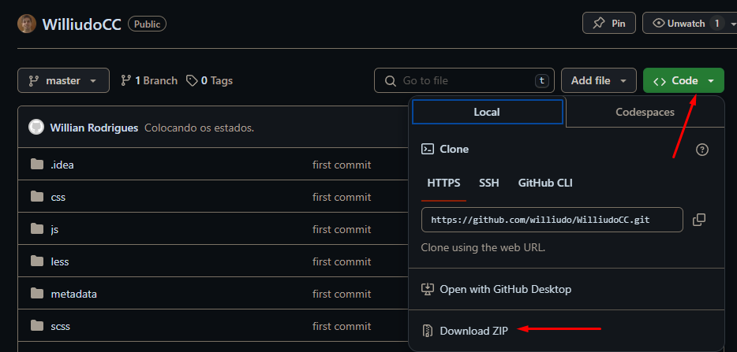
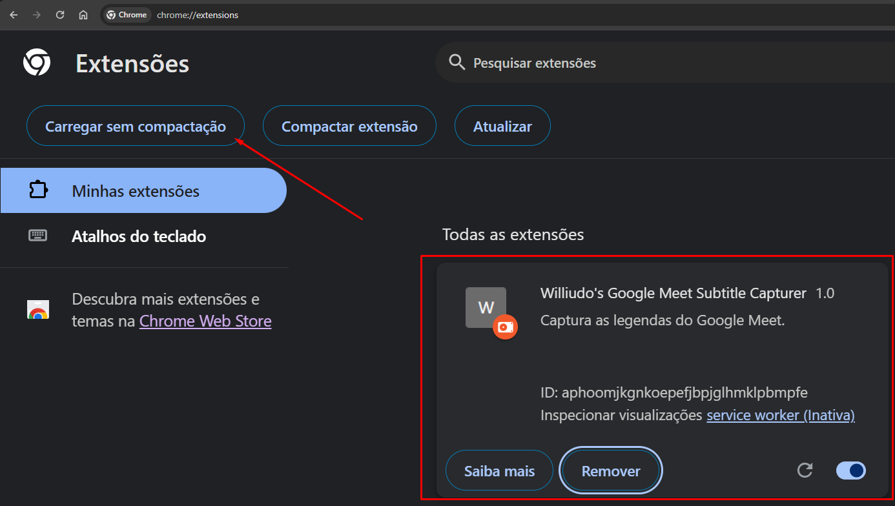
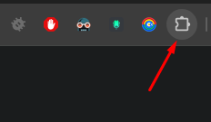
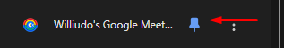
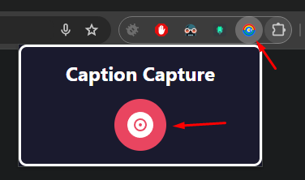
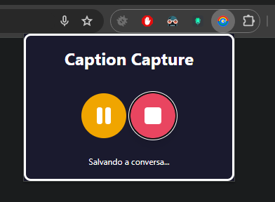
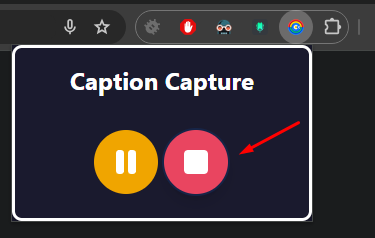

# Williudo's Google Meet Subtitle Capturer

Esta extensão captura as legendas do Google Meet e salva-as em um arquivo de texto. Siga as instruções abaixo para instalar e usar a extensão.

## Instruções de Instalação

### Passo 1: Baixar a Extensão do GitHub

1. Acesse o repositório do GitHub.
2. Clique no botão verde `Code` e selecione `Download ZIP`.

### Passo 2: Descompactar o Arquivo

1. Localize o arquivo ZIP baixado no seu computador.
2. Descompacte o arquivo para uma pasta de sua preferência.

### Passo 3: Abrir a Página de Extensões no Chrome

1. Abra o Chrome e digite `chrome://extensions/` na barra de endereços.
2. Ative o `Modo de desenvolvedor` no canto superior direito da página.

### Passo 4: Carregar a Extensão sem Compactação

1. Clique no botão `Carregar sem compactação`.
2. Navegue até a pasta onde você descompactou a extensão e selecione-a.

### Passo 5: Ativar a Extensão

1. Certifique-se de que a extensão está ativada.

### Passo 6: Fixar a Extensão no Navegador

1. Clique no ícone de quebra-cabeça ao lado da barra de endereços do Chrome.
2. Encontre "Williudo's Google Meet Subtitle Capturer" na lista e clique no ícone de alfinete para fixá-la na barra de ferramentas do navegador.

## Como Usar a Extensão no Google Meet

1. Inicie uma reunião no Google Meet.
2. Clique no ícone da extensão fixada na barra de ferramentas do Chrome para abrir o painel de controle da extensão.

3. Clique no botão de gravação para começar a capturar as legendas.

4. Para pausar ou parar a captura, use os botões correspondentes no painel da extensão.

## Nota

As legendas capturadas serão salvas em um arquivo de texto com a seguinte mensagem ao final:
-----
Isso é uma captura de legendas do google meet, onde fazemos a nossa daily de desenvolvimento.
Só que está muito desorganizado, crie uma ata.

Dos assuntos que foram falados, separados pelo que cada pessoa disse de forma resumida.
Mas não coloque piadas, palavrões ou conversas inapropriadas.

Se foi falado sobre algo que será feito, coloque como ações.
é muito importante, não colocar nada que não foi dito. Somente coloque o que foi falado acima
Se não foi falado nada acima de ------, então simplemente mencione que não tem nada.

##

Pronto! Agora você está preparado para capturar as legendas das suas reuniões do Google Meet de forma organizada.